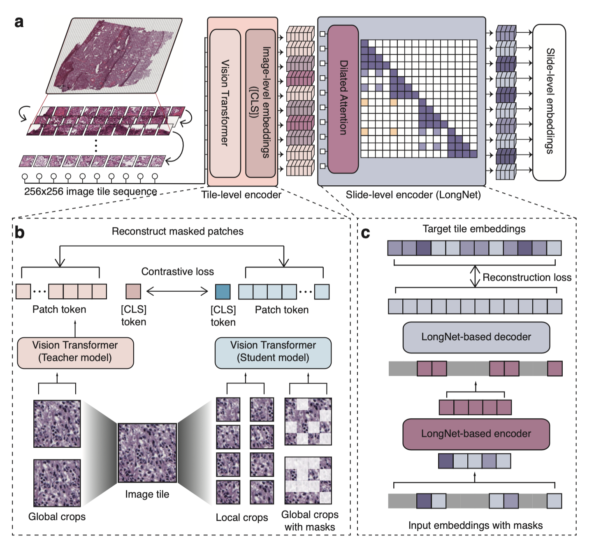

# Prov-GigaPath

## A whole-slide foundation model for digital pathology from real-world data

[[`Model`](https://huggingface.co/prov-gigapath/prov-gigapath)] [[`Paper`](https://aka.ms/gigapath)] [[`BibTeX`](#Citation)]

Hanwen Xu*, Naoto Usuyama*, Jaspreet Bagga, Sheng Zhang, Rajesh Rao, Tristan Naumann, Cliff Wong, Zelalem Gero, Javier González, Yu Gu, Yanbo Xu, Mu Wei, Wenhui Wang, Shuming Ma, Furu Wei, Jianwei Yang, Chunyuan Li, Jianfeng Gao, Jaylen Rosemon, Tucker Bower, Soohee Lee, Roshanthi Weerasinghe, Bill J. Wright, Ari Robicsek, Brian Piening, Carlo Bifulco, Sheng Wang, Hoifung Poon (*Equal Contribution)

[]()

## 📢 News

### September 2024
- **Embeddings**: We are pleased to share a new notebook, showcasing embedding visualization for Prov-GigaPath. Check out the [notebook](https://github.com/prov-gigapath/prov-gigapath/blob/main/demo/gigapath_pca_visualization_timm.ipynb) to get started.


### July 2024
- **WSI Preprocessing/Tiling**: We are pleased to share new preprocessing guide for Prov-GigaPath. This guide provides a walkthrough on setting up the environment and preprocessing WSI files for Prov-GigaPath. Check out the [guide](https://github.com/prov-gigapath/prov-gigapath/blob/main/gigapath/preprocessing/preprocessing.md) to get started.

### June 2024
- **New Demo Notebook Available**: We have prepared a new notebook for the walkthrough of the Prov-GigaPath model. This notebook provides a detailed demonstration of how to load and run the pretrained model. You can check it out [here](https://github.com/prov-gigapath/prov-gigapath/blob/main/demo/run_gigapath.ipynb).

### May 2024
- **Initial Model and Code Release**: We are excited to announce that the initial release of the Prov-GigaPath model and its code is now available. The [GigaPath paper](https://aka.ms/gigapath) has been published in *Nature*.

## Model Overview

<p align="center">
     <br>

  *Overview of Prov-GigaPath model architecture*

</p>

## Install

On an NVIDIA A100 Tensor Core GPU machine, with CUDA toolkit enabled.

1. Download our repository and open the Prov-GigaPath
```
git clone https://github.com/prov-gigapath/prov-gigapath
cd prov-gigapath
```

2. Install GigaPath and its dependencies

```Shell
conda env create -f environment.yaml
conda activate gigapath
pip install -e .
```

## Model Download

The Prov-GigaPath models can be accessed from [HuggingFace Hub](https://huggingface.co/prov-gigapath/prov-gigapath).

You need to agree to the terms to access the models. Once you have the necessary access, set your HuggingFace read-only token as an environment variable:
```
export HF_TOKEN=<huggingface read-only token>
```

If you don’t set the token, you might encounter the following error:
```
ValueError: We have no connection or you passed local_files_only, so force_download is not an accepted option.
```

## Inference

The Prov-GigaPath model consists of a tile encoder, that extracts local patterns at patch level, and a slide encoder, that outputs representations at slide level. This model can be used in both tile-level and slide-level tasks. When doing inference at the slide level, we recommend following this pipeline: (1) Tile the whole slide into N image tiles, with the coordinates of each tile. (2) Get the embeddings for each tile using our tile encoder. (3) Pass the N image tile embeddings and their coordinates into the slide encoder, to get slide level representations.

### Inference with the tile encoder

First, load GigaPath tile encoder:

```Python
import timm
from PIL import Image
from torchvision import transforms
import torch

# Older versions of timm have compatibility issues. Please ensure that you use a newer version by running the following command: pip install timm>=1.0.3.
tile_encoder = timm.create_model("hf_hub:prov-gigapath/prov-gigapath", pretrained=True)

transform = transforms.Compose(
    [
        transforms.Resize(256, interpolation=transforms.InterpolationMode.BICUBIC),
        transforms.CenterCrop(224),
        transforms.ToTensor(),
        transforms.Normalize(mean=(0.485, 0.456, 0.406), std=(0.229, 0.224, 0.225)),
    ]
)
```

Running inference to extract tile level features:

```Python
img_path = "images/prov_normal_000_1.png"
sample_input = transform(Image.open(img_path).convert("RGB")).unsqueeze(0)

tile_encoder.eval()
with torch.no_grad():
    output = tile_encoder(sample_input).squeeze()
```

**

### Inference with the slide encoder

To inference with our slide encoder, we need both the tile embeddings and their coordinates as input. First, let's load the GigaPath slide encoder:

```Python
import gigapath

slide_encoder = gigapath.slide_encoder.create_model("hf_hub:prov-gigapath/prov-gigapath", "gigapath_slide_enc12l768d", 1536)
```

Run the inference to get the slide level embeddings:

```Python
slide_encoder.eval()
with torch.no_grad():
    output = slide_encoder(tile_embed, coordinates).squeeze()
```


**Note** Older versions of timm have compatibility issues. Please ensure that you use a newer version by running the following command: pip install timm>=1.0.3.


## Fine-tuning

### Tile-Level Linear Probing Example Using PCam Dataset

For your convenience, we provide the pre-extracted embeddings for the PCam dataset. You can download them from the link below. Note that the file size is 2GB.
```sh
wget -nc https://hanoverprod.z21.web.core.windows.net/gigapath/GigaPath_PCam_embeddings.zip -P data/
```

There is no need to unzip this file.

To run the fine-tuning experiment, execute the following script:
```sh
bash scripts/run_pcam.sh data/GigaPath_PCam_embeddings.zip
```

### Slide-Level Fine-Tuning Example Using PANDA Dataset

For your convenience, we provide the pre-extracted embeddings for the PANDA dataset. You can download them from the link below. Note that the file size is 32GB. Please unzip this file.
```sh
wget -nc https://hanoverprod.z21.web.core.windows.net/gigapath/GigaPath_PANDA_embeddings.zip -P data/
unzip -n data/GigaPath_PANDA_embeddings.zip -d data/
```

To run the fine-tuning experiment, execute the following script:
```sh
bash scripts/run_panda.sh data/GigaPath_PANDA_embeddings/h5_files
```

## Sample Data Download

A sample de-identified subset of the Prov-Path data can be accessed from these links [[1](https://zenodo.org/records/10909616), [2](https://zenodo.org/records/10909922)].

## Model Uses

### Intended Use
The data, code, and model checkpoints are intended to be used solely for (I) future research on pathology foundation models and (II) reproducibility of the experimental results reported in the reference paper. The data, code, and model checkpoints are not intended to be used in clinical care or for any clinical decision-making purposes.

### Primary Intended Use
The primary intended use is to support AI researchers reproducing and building on top of this work. GigaPath should be helpful for exploring pre-training, and encoding of digital pathology slides data.

### Out-of-Scope Use
**Any** deployed use case of the model --- commercial or otherwise --- is out of scope. Although we evaluated the models using a broad set of publicly-available research benchmarks, the models and evaluations are intended *for research use only* and not intended for deployed use cases.

## Usage and License Notices

The model is not intended or made available for clinical use as a medical device, clinical support, diagnostic tool, or other technology intended to be used in the diagnosis, cure, mitigation, treatment, or prevention of disease or other conditions. The model is not designed or intended to be a substitute for professional medical advice, diagnosis, treatment, or judgment and should not be used as such.  All users are responsible for reviewing the output of the developed model to determine whether the model meets the user’s needs and for validating and evaluating the model before any clinical use.

## Acknowledgements

We would like to express our gratitude to the authors and developers of the exceptional repositories that this project is built upon: DINOv2, MAE, Timm, and TorchScale. Their contributions have been invaluable to our work.

## Citation
If you find Prov-GigaPath useful for your your research and applications, please cite using this BibTeX:

```bibtex
@article{xu2024gigapath,
  title={A whole-slide foundation model for digital pathology from real-world data},
  author={Xu, Hanwen and Usuyama, Naoto and Bagga, Jaspreet and Zhang, Sheng and Rao, Rajesh and Naumann, Tristan and Wong, Cliff and Gero, Zelalem and González, Javier and Gu, Yu and Xu, Yanbo and Wei, Mu and Wang, Wenhui and Ma, Shuming and Wei, Furu and Yang, Jianwei and Li, Chunyuan and Gao, Jianfeng and Rosemon, Jaylen and Bower, Tucker and Lee, Soohee and Weerasinghe, Roshanthi and Wright, Bill J. and Robicsek, Ari and Piening, Brian and Bifulco, Carlo and Wang, Sheng and Poon, Hoifung},
  journal={Nature},
  year={2024},
  publisher={Nature Publishing Group UK London}
}
```
